# Autonomy Preserving AI (APAI): KAIST AI Future Challenge Idea Competition Submission

A proof of concept implementation of a middleware framework that monitors user cognitive engagement across skill domains and dynamically modulates AI assistance to prevent skill atrophy. The project has two scripts: a discrete-time EKF simulation and a continuous-time ODE simulation with live Gemini 2.5 Flash integration. The future work involves utilizing multi agent framework, skill directed graph and trained human capability agent to prevent skill decay while maintaining Ai utilization for productivity. Check out the landing page at:
 [website](https://adnansadik.dev/apai)

<p align="center">
  
</p>

---

## Scripts

### `apai_demo/apai_estimation_poc.py` — Discrete-time EKF simulation

Runs three competing scenarios across a three-node prerequisite skill chain (Arithmetic → Probability → Markov Chain) using an Extended Kalman Filter to estimate latent capability from noisy behavioral observations at each interaction step. In future this can be replaced by offline trained AI agent.

### `apai_demo/main.py` — Continuous-time ODE simulation + LLM modulation

Runs the same three-policy comparison using a continuous-time ODE solver, and additionally queries the Gemini 2.5 Flash API to demonstrate how the assistance deterrent level translates into real LLM behavior via system prompt modulation. In future, this can be replaced by a subagent.

---

## Math

### Observation function `phi(l_t, d_t, e_t)` *(apai_estimation_poc.py)*

Compresses three behavioral proxies into a scalar observation `o_t`:

```
o_t = 0.5 * (1 - l_t / 30) + 0.3 * d_t + 0.2 * e_t + eps,   eps ~ N(0, sigma^2)
```

- `l_t`: response latency — inverted and normalized so higher latency signals lower capability
- `d_t`: edit distance between user input and AI output, clipped to [0, 1] — larger divergence means the user is engaging independently
- `e_t`: engagement score from follow-up questions and self-corrections

### Effective decay rate `Lambda_vec(c)`

Decay rates are state-dependent and coupled across the prerequisite DAG:

```
Lambda_v1 = lam
Lambda_v2 = lam + gamma * (1 - c_v1)
Lambda_v3 = lam + gamma * (1 - c_v2)
```

Atrophy in a prerequisite node raises the effective decay rate of dependent nodes by `gamma` per unit of lost proficiency, encoding the prerequisite cascade effect.

### Capability ODE `ode_rhs / capability_rhs`

For each domain v:

```
dc_v/dt = u_v * (mu * c_v^alpha + Lambda_v) - Lambda_v
```

- Capability grows when `u_v > Lambda_v / (mu * c_v^alpha + Lambda_v)` (the break-even threshold)
- The sublinear exponent `alpha < 1` encodes diminishing returns on recovery when capability is low — relearning an atrophied skill is harder the more completely it has been lost
- Decay is absorbing near `c_v = 0`: recovery becomes arbitrarily slow

### Atrophy threshold `c_star`

The unstable equilibrium under constant engagement `u_bar`:

```
c* = ( lam * (1 - u_bar) / (mu * u_bar) ) ^ (1 / alpha)
```

Below `c*`, capability drifts toward 0 even with partial engagement. The APAI policy is designed to keep capability above this threshold at all times.

### Break-even control `u_eq` *(apai_estimation_poc.py)*

The minimum engagement level needed to prevent decay at the current estimate:

```
u_eq_v = Lambda_v / (mu * c_hat_v^alpha + Lambda_v)
```

### EKF predict step `ekf_predict` *(apai_estimation_poc.py)*

Propagates the Gaussian posterior `(c_hat, P)` forward through the nonlinear dynamics using a first-order linearization:

```
c_hat_v  <-  c_hat_v + f_v(c_hat_v, u_v)
P_v      <-  P_v + 2 * (df_v/dc_v) * P_v - P_v^2 / sigma^2 + Q_v
```

where `df_v/dc_v = u_v * mu * alpha * c_hat_v^(alpha - 1)` is the Jacobian of the drift. `Q_v` is process noise absorbing model mismatch. Variance is clipped to `[1e-6, 5*sigma^2]` to prevent filter divergence.

### EKF update step `ekf_update` *(apai_estimation_poc.py)*

Corrects the predicted estimate using the scalar observation `o_t` for domain v:

```
K        = P_v / (P_v + sigma^2)
c_hat_v  <-  c_hat_v + K * (o_t - c_hat_v)
P_v      <-  (1 - K) * P_v
```

The Kalman gain K is large when posterior variance is high relative to observation noise, weighting the new observation more heavily when the model is uncertain.

### APAI assistance policy

**Discrete-time greedy policy** `schedule_apai` *(apai_estimation_poc.py)*: a threshold policy with a deadband of 0.05 around `c*` to suppress chattering from observation noise:

```
u_v = 0.55 + 0.35 * max(0, c*_v - c_hat_v) / c*_v   if c_hat_v < c*_v - 0.05
u_v = 0.50                                             otherwise
```

**Continuous-time policy** `policy_apai` *(main.py)*: derived from the optimal control objective by maximizing task utility minus a penalty on capability loss:

```
u_v = clip( 1 - (gamma_u / (beta * (mu * c_v^alpha + Lambda_v)))^(1 / (gamma_u - 1)), 0, 1 )
```

where `beta` is the autonomy weight trading off task utility against capability preservation, and `gamma_u` is the utility curvature parameter.

### Cumulative task utility *(main.py)*

Task utility is measured as the integral of `sum_v (1 - u_v)^gamma_u` over time — higher AI delegation (lower u) yields higher immediate utility but at the cost of capability:

```
CU(t) = integral_0^t  sum_v (1 - u_v(tau))^gamma_u  dtau
```

Computed via `scipy.integrate.cumulative_trapezoid`.

---

## LLM Modulation via Gemini 2.5 Flash

`main.py` queries `gemini-2.5-flash` with three system prompts corresponding to discretized assistance deterrent levels:

| Level | u | Behavior |
|---|---|---|
| Full Assistance | 0.0 | Complete step-by-step solution |
| Partial Assistance | 0.5 | First step only, then Socratic guiding question |
| Full Deferral | 1.0 | Teaches prerequisite concept, withholds original problem solution |

The API key is read from the environment variable `GEMINI_API_KEY`. Responses are saved to `apai_responses.txt`.

---

## Requirements

```
numpy
matplotlib
scipy
google-generativeai
```

## Setup

```bash
pip install numpy matplotlib scipy google-generativeai
export GEMINI_API_KEY=your_api_key_here
```

## Usage

```bash
# Discrete-time EKF simulation
python apai_estimation_poc.py

# Continuous-time ODE simulation + Gemini LLM queries
python main.py
```

### Outputs

`apai_estimation_poc.py`:
- `apai_estimation_poc.pdf / .png` — full 2×3 grid
- `apai_capability_{domain}.png` — per-domain capability traces with EKF confidence bands
- `apai_assistance_deterrent_v3.png` — assistance deterrent level over time
- `apai_lambda_v2.png` — cascade effect on effective decay rate
- `apai_uncertainty_v3.png` — EKF posterior variance over time

`main.py`:
- `apai_simulation.pdf / .png` — capability trajectories and cumulative task utility
- `apai_responses.txt` — Gemini responses at each assistance level

---

## Key parameters

| Parameter | Description | Default |
|---|---|---|
| `alpha` | Sublinear recovery exponent | 0.6 |
| `gamma_c` | Prerequisite coupling strength | 0.05 |
| `sigma` | Observation noise std *(EKF script)* | 0.15 |
| `mu` | Recovery rate | 0.3 |
| `lam` | Baseline decay rate | 0.1 |
| `beta` | Autonomy weight *(ODE script)* | 1.5 |
| `gamma_u` | Utility curvature *(ODE script)* | 2.0 |
| `T` | Interaction steps *(EKF script)* | 30 |
| `t_span` | Simulation time *(ODE script)* | (0, 100) |
